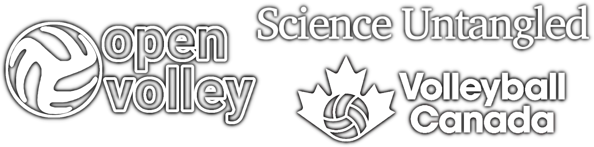

# R workshop 2022

Structure: 5 x two-hour sessions, each with presentation of course material, and time during which participants can work on exercises or with their own data.

## Draft course sessions

1. Introductions and a general overview of R.

1. Focus on the `datavolley` package in R, reading your data in and working with it.

1. Different methods of conveying information (tables, graphs, court plots, video) and how to generate these in R. Heatmaps, video playlists, and more.

1. Advanced analytics to support decision making, match preparation, and similar. Examples of statistical models, simulating matches.

1. Other odds and ends: computer vision and video processing, a brief introduction to R Shiny apps.

## Acknowledgements

The example data used in this workshop was provided by:

- `DE Men 2019` - 10 matches from the 2019/20 German 1. Bundesliga (Men) season, provided by Michael Mattes
- `DE Women 2020` - 3 matches from the 2020/21 German 1. Bundesliga (Women) season, provided by Michael Mattes
- `VNL_Women_2021.csv` - a summary of team performance from the 2021 Women's Volleyball Nations League. Match data provided by Pablo Sánchez Morillas and Lauren Bertolacci, and analyzed with https://apps.untan.gl
