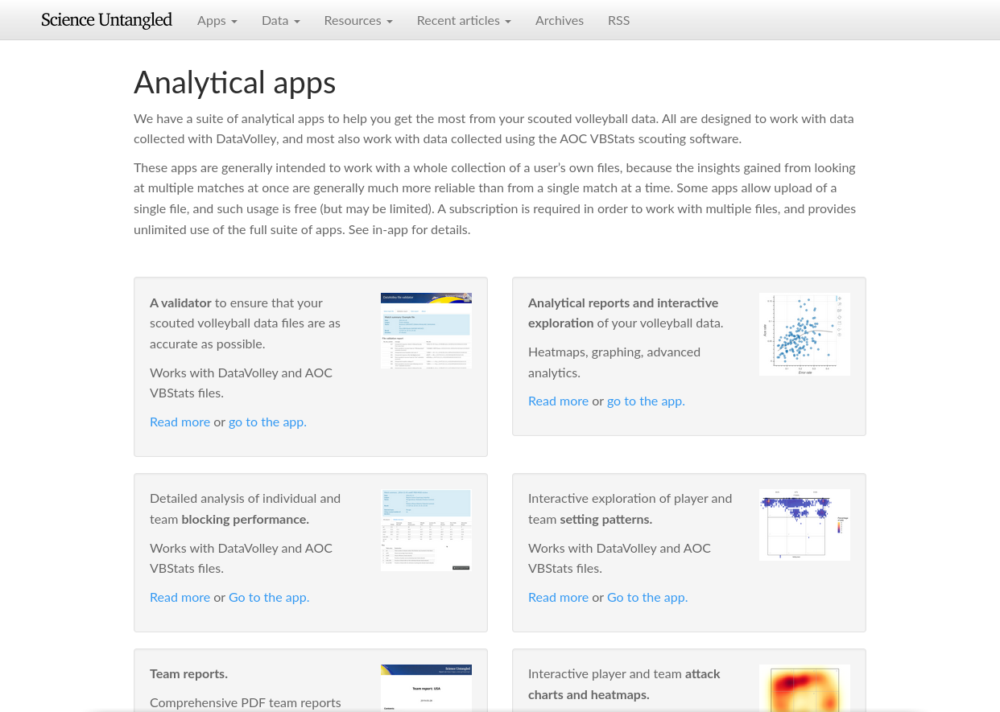

layout: true

<div class="my-footer">
  <div class="my-footer-box"><a href="https://openvolley.org/">openvolley.org</a></div>
  <div class="my-footer-box"><a href="https://https://volleyball.ca/"></a></div>
  <div class="my-footer-box"><a href="https://untan.gl/"></a></div>
</div>

---

```{r setup, include=FALSE}
options(htmltools.dir.version = FALSE)
options(knitr.kable.NA="")
knitr::opts_chunk$set(echo = TRUE, warning = FALSE, message = FALSE, cache = FALSE, dpi = 120, fig.height = 3, fig.width = 6)
library(dplyr)
library(ggplot2)
library(datavolley)
library(knitr)
options(tibble.width = 65, tibble.print_max = 10, tibble.print_min = 10, width = 80)

```

class: inverse, logo, center


## Session 1: Introduction to R

### Ben Raymond, Adrien Ickowicz

##### with valuable contributions from many others...


---
## What are we going to talk about in this session

- introductions
- the openvolley project
- R in general
- aims for this workshop, session outlines
- using R, first details


---
## The openvolley project

2016-ish to now

#### Aim

To develop and foster volleyball analytics approaches that are <strong>*informative*</strong>, <strong>*accessible*</strong>, and <strong>*advanced*</strong>.

Do this by developing <strong>*technical*</strong> and <strong>*community*</strong> resources


---
## The openvolley project

- software, primarily R-based
  - family of packages (code building blocks) ... "more but smaller" approach
  - apps
  - documentation

- other community resources
  - example analyses, code snippets
  - discussion fora (Slack)
  - data

---
## The openvolley project

Contribute:

- code snippets, examples of use
- data (scout files)
- bug reports, improvements to documentation
- or anything else

---
## openvolley software overview

**Scouting:** <span class="pkg">ovscout</span> <span class="nonpkg">DataVolley, VolleyStation, etc</span> <span class="nonpkg">VBStats</span>

**Other data:** <span class="pkg">ovdata</span> <span class="pkg">fivbvis</span>

&nbsp;

**Reading data into R:** <span class="pkg">datavolley</span> <span class="pkg">peranavolley</span> <span class="Rpkg">rvest</span>

**Analysis and graphing:** <span class="pkg">ovlytics</span> <span class="pkg">volleysim</span> <span class="Rpkg">ggplot2</span>

**Reporting and sharing:** <span class="pkg">volleyreport</span> <span class="pkg">ovplayer</span> <span class="Rpkg">Shiny</span> <span class="Rpkg">rmarkdown</span>

**Video review and analysis:** <span class="pkg">ovideo</span> <span class="pkg">ovva</span>

**Computer vision and AI:** <span class="pkg">ovml</span>

.footnote[**Key:** <span class="pkg">openvolley R package</span> <span class="Rpkg">other R package</span> <span class="nonpkg">non-R software</span>]

---

## Why R?


Reproducible, shareable code

Rich functionality for data handling, graphics, apps, report generation

Open source and free

Community

Traditional stronghold for statistical analysis

Package ecosystem (~19,000 on CRAN, more on Github, Bioconductor, elsewhere)

... on the down side: learning curve?

The openvolley project aims to lower that barrier

---
## Science Untangled

Volleyball analytics apps: https://apps.untan.gl



---
## Aims for this workshop

We hope to give you a much better idea of what can be done in R, and (improved) skills in using it.

You won't be an expert by the end of this workshop!

We'll be describing

- code building blocks (that you can write your own code with)

  as well as

- tools that you can use without writing much or even any code.

---
## R sessions for this workshop

1. Introductions and a general overview of R.

1. Focus on the `datavolley` package in R, reading your data in and working with it.

1. Different methods of conveying information (tables, graphs, court plots, video) and how to generate these in R. Heatmaps, video playlists, and more.

1. Advanced analytics to support decision making, match preparation, and similar. Examples of statistical models, simulating matches.

1. Other odds and ends: computer vision and video processing, a brief introduction to R Shiny apps.


---
## Session 1 setup

1. Have R and RStudio installed:

  https://www.rstudio.com/products/rstudio/download/#download

2. Install the tidyverse packages:
  ```{r eval = FALSE}
  install.packages("tidyverse")
  ```
3. Clone the workshop repository

  From the RStudio menu:

    -  `File` -> `New Project ...` -> `Version Control` -> `Git`

    -  Repository URL: https://github.com/openvolley/R_workshop_2022

  Select the location to save it and `Create Project`

---
## R &mdash; Overview


- commands and scripts
- base functionality and packages

---
## R &mdash; Data types:

- numeric
- integer
- logical
- character
- factor
- Date


- converting: `as.whatever()`

- automatic conversion: `2 + TRUE`, but not e.g. `2 + "1"`

- `NA`, `NaN`, `Inf`

---
## R &mdash; Variables, assignment

evaluating without assigning just prints the result to the console:

```{r}
"blah"

```

--

To save the result, assign it:

`x <- 1`

assigns the value `1` to the variable `x`.

This is (broadly) the same as using `x = 1` ...

... but note that `x == 1` is very different.

---
## R &mdash; Data structures: vectors

- constructing with e.g. `c()`

- sequences

- indexing

---
## R &mdash; Arithmetic operations

- range, min, max, unique

- `NA` handling


---
## R &mdash; Data structures: lists

- constructing

- names

- indexing: `[ ]`, `[[ ]]`, and `$`

---
## R &mdash; Data structures: data frames and tibbles

A tibble is a table-like, rectangular data structure:

```{r eval = FALSE}
library(dplyr)
x <- tibble(Var1 = c(1, 2, 2),
            Var2 = c("cat", "dog", "rabbit"))
View(x)

```

```{r echo = FALSE}
library(dplyr)
x <- tibble(Var1 = c(1, 2, 2),
            Var2 = c("cat", "dog", "rabbit"))
knitr::kable(x, row.names = FALSE)

```

- tibbles are arranged by `[row, column]`

---
## R &mdash; Data structures: data frames and tibbles

- subset by row

```{r}
x[3, ]

```

- by column number

```{r}
x[, 2]

```

---
## R &mdash; Data structures: data frames and tibbles

- extract a column by name

```{r}
x$Var2

```

- or by number

```{r}
x[[2]]

```


---
## R &mdash; Data structures: data frames and tibbles

- a `data.frame` is almost the same as a data.frame, but with some differences in behaviour

```{r}
y <- data.frame(Var1 = c(1, 2, 2),
                Var2 = c("cat", "dog", "rabbit"))

```

---
## R &mdash; Programming:

- control: `if` statements

```{r eval = FALSE}

if (condition) {
    ## do stuff
} else if (other_condition) {
    ## do other stuff
} else {
    ## yet more stuff
}

```

---
## R &mdash; Programming:

- repetition: `for` loops

```{r eval = FALSE}
for (variable in vector) {
    ## do something with variable
}

```

- iterates through each element in `vector` and runs the code inside the braces


- Avoid e.g. : `for (i in 1:length(x))`

  - use `for (i in seq_len(length(x)))`

      or `for (i in seq_along(x))`

---
## R &mdash; Programming:

- repetition: `lapply`

```{r eval = FALSE}
lapply(vector, fun)

```

- applies function `fun` to each element in `vector` and returns all results in a list


---
## R &mdash; Programming:

- writing functions

```{r eval = FALSE}

myfun <- function(a, b) {
    y <- a + b ## code that operates on parameters a and b
    return(y)
}

```

- `lapply` with your own function can be useful:

```{r eval = FALSE}
y <- lapply(x, function(z) {
    ## do something to each element of x
})

```

---
## R &mdash; Packages

https://cran.r-project.org/ has ~19k packages, more on GitHub and other package repositories.

Install packages from CRAN with

```{r eval = FALSE}
install.packages(c("package1", "package2"))`

```

Or from GitHub with

```{r eval = FALSE}
library(remotes)
install_github("owner/repo")

```

(Many CRAN packages are also on GitHub, with the development version on GitHub and the stable release on CRAN.)

---
## R &mdash; Packages

- a package only needs to be installed once (or when needing an update).
- but needs to be loaded each session before calling any of its functions:

```{r eval = FALSE}
library(dadjokes)
dadjoke()

```

> I'm so good at sleeping, I can do it with my eyes closed!

<br />

Or use `pkg::fun()` to refer to function `fun` in package `pkg`, even without loading the package first:

```{r eval = FALSE}
dadjokes::dadjoke()

```
> I like telling Dad jokes.
>
> Sometimes he laughs!


---
## R &mdash; Tidyverse packages

See https://tidyverse.org. A set of packages that provide a (relatively) consistent syntax and user experience, designed for many of the data manipulation and analysis tasks that we need to do.

Install with:

```{r eval = FALSE}
install.packages("tidyverse")

```

The main tidyverse packages that we will be using are:
- dplyr (data manipulation)
- ggplot2 (plotting)
- stringr (dealing with strings)
- lubridate (dates and times)

---
## R &mdash; Tidyverse packages

Load core tidyverse packages in one go:

```{r eval = FALSE}
library(tidyverse)

```

```
── Attaching packages ────────────────────────────────────────────────────────────────────────────────── tidyverse 1.3.1 ──
✓ ggplot2 3.3.5     ✓ purrr   0.3.4
✓ tibble  3.1.6     ✓ dplyr   1.0.8
✓ tidyr   1.2.0     ✓ stringr 1.4.0
✓ readr   2.1.2     ✓ forcats 0.5.1
── Conflicts ───────────────────────────────────────────────────────────────────────────────────── tidyverse_conflicts() ──
x dplyr::filter() masks stats::filter()
x dplyr::lag()    masks stats::lag()
```

<br />

Or load specific packages:

```{r eval = FALSE}
library(dplyr)
library(ggplot2)

```


---
## R &mdash; dplyr

```{r}
library(tidyverse)

x <- read_csv("example_data/VNL_Women_2021.csv")
x

```

---
## R &mdash; dplyr

The pipe operator `%>%`

```{r eval = FALSE}
final_result <- data %>% do_something %>% do_something_else

```

---
## R &mdash; dplyr

Filtering rows (`filter`)

```{r}
x %>% filter(N_sets_played >= 60)

```

---
## R &mdash; dplyr

Multiple filtering conditions with `&` ("and") and `|` ("or")

```{r}
x %>% filter(N_sets_played >= 60 | Sets_won > 70)

```

---
## R &mdash; dplyr

Multiple filtering conditions with `&` ("and") and `|` ("or")

```{r}
x %>% filter(N_sets_played >= 60 & Sets_won > 70)

```

---
## R &mdash; dplyr

Selecting columns (`select`)

```{r}
x %>% select(Team, N_sets_played, Sets_won)

```

---
## R &mdash; dplyr

Renaming while selecting (`select`)

```{r}
x %>% select(Team, Played = N_sets_played, Won = Sets_won)

```

---
## R &mdash; dplyr

Just renaming, keeping all columns (`rename`)

```{r}
x %>% rename(Played = N_sets_played, Won = Sets_won)

```

---
## R &mdash; dplyr

Adding or changing columns (`mutate`)

```{r}
x %>% mutate(Sets_won = N_sets_played / 100,
             Team_abbrev = str_to_upper(str_sub(Team, 1, 3))) %>%
    select(Team, Team_abbrev, N_sets_played, Sets_won)

```

---
## R &mdash; dplyr

Ordering rows (`arrange`)

```{r}
x %>% arrange(N_sets_played) %>%
    select(Team, N_sets_played, Sets_won)

```

---
## R &mdash; dplyr

Or in descending order with `desc`

```{r}
x %>% arrange(desc(N_sets_played)) %>%
    select(Team, N_sets_played, Sets_won)

```

---
## R &mdash; dplyr

Summarizing (`summarize`)

```{r}
x %>% summarize(Mean_N_sets_played = mean(N_sets_played),
                Max_sets_won = max(Sets_won))

```

(compare with `mean(x$N_sets_played)` and `max(x$Sets_won)`)

---
## R &mdash; dplyr

Groups (`group_by`)

```{r}
x %>% group_by(Status)

```

---
## R &mdash; dplyr

Operating on groups

```{r}
x %>% group_by(Status) %>%
    summarize(Mean_N_sets_played = mean(N_sets_played),
              Max_sets_won = max(Sets_won))

```

---
## R &mdash; dplyr

Operating on groups

```{r}
x %>% group_by(Status) %>%
    filter(N_sets_played > mean(N_sets_played)) %>%
    ungroup

```

---
## R &mdash; dplyr

Split - apply - combine

- `bind_rows(lapply(...))`

---
## R &mdash; Base graphics

Plotting with base graphics

```{r}
plot(x$R_POS, x$FBSO)

```


---
## R &mdash; ggplot

Plotting with `ggplot2`

- "grammar of graphics"
- a plot is treated as a combination of various elements
- minimal usage: provide `ggplot` with:

  - the data to use
  - aesthetics (how to map the variables in the data to visual properties of the plot)
  - geometries (what to show on the plot: points, lines, etc)

---
## R &mdash; ggplot

```{r}
library(ggplot2)
ggplot(x, aes(x = R_POS, y = FBSO)) + geom_point()

```

---
## R &mdash; ggplot

```{r eval = FALSE}
ggplot(x, aes(x = R_POS, y = FBSO)) + geom_point(`aes(col = Team)`)

```
```{r echo = FALSE}
ggplot(x, aes(x = R_POS, y = FBSO)) + geom_point(aes(col = Team))

```

---
## R &mdash; ggplot

```{r eval = FALSE}
ggplot(x, aes(x = R_POS, y = FBSO)) + geom_point(`col = "red"`) +
    `geom_text(aes(label = Team))`

```
```{r echo = FALSE}
ggplot(x, aes(x = R_POS, y = FBSO)) + geom_point(col = "red") +
    geom_text(aes(label = Team))

```

---
## R &mdash; ggplot

```{r eval = FALSE}
ggplot(x, aes(x = R_POS, y = FBSO)) + geom_point(col = "red") +
    geom_text(aes(label = Team)`, hjust = -0.1`)

```
```{r echo = FALSE}
ggplot(x, aes(x = R_POS, y = FBSO)) + geom_point(col = "red") +
    geom_text(aes(label = Team), hjust = -0.1)

```

---
## R &mdash; ggplot

```{r eval = FALSE}
ggplot(x, aes(x = R_POS, y = FBSO)) + geom_point(col = "red") +
 geom_text(aes(label = Team), hjust = -0.1)` + xlim(c(NA, 58))`

```
```{r echo = FALSE}
ggplot(x, aes(x = R_POS, y = FBSO)) + geom_point(col = "red") +
 geom_text(aes(label = Team), hjust = -0.1) + xlim(c(NA, 58))

```

---
## R &mdash; ggplot

```{r eval = FALSE}
ggplot(x, aes(x = R_POS, y = FBSO)) + geom_point(col = "red") +
 `geom_smooth(method = "lm", se = FALSE) +`
 geom_text(aes(label = Team), hjust = -0.1) + xlim(c(NA, 58))

```
```{r echo = FALSE}
ggplot(x, aes(x = R_POS, y = FBSO)) + geom_point(col = "red") +
 geom_smooth(method = "lm", se = FALSE) +
 geom_text(aes(label = Team), hjust = -0.1) + xlim(c(NA, 58))

```

---
## R &mdash; ggplot

```{r eval = FALSE}
ggplot(x, aes(x = R_POS, y = FBSO)) + geom_point(col = "red") +
 geom_smooth(method = "lm", se = FALSE) + `theme_bw() +`
 geom_text(aes(label = Team), hjust = -0.1) + xlim(c(NA, 58)) +
 `labs(x = "Positive/perfect reception %", y = "First ball sideout %")`

```
```{r echo = FALSE}
ggplot(x, aes(x = R_POS, y = FBSO)) + geom_point(col = "red") +
 geom_smooth(method = "lm", se = FALSE) + theme_bw() +
 geom_text(aes(label = Team), hjust = -0.1) + xlim(c(NA, 58)) +
 labs(x = "Positive/perfect reception %", y = "First ball sideout %")

```

---
## R &mdash; ggplot: other geometries

```{r eval = FALSE}
ggplot(x, aes(x = REC_ATT_EFF)) +
    `geom_histogram`(binwidth = 2.5, col = "black", fill = "grey50") +
    theme_bw() + labs(x = "Reception attack efficiency")

```
```{r echo = FALSE}
ggplot(x, aes(x = REC_ATT_EFF)) +
    geom_histogram(binwidth = 2.5, col = "black", fill = "grey50") +
    theme_bw() + labs(x = "Reception attack efficiency")

```

---
## R &mdash; ggplot: subplots (facets)

```{r eval = FALSE}
ggplot(x, aes(x = REC_ATT_EFF)) +
    geom_histogram(binwidth = 2.5, col = "black", fill = "grey50") +
    `facet_wrap(~Status)` +
    theme_bw() + labs(x = "Reception attack efficiency")

```
```{r echo = FALSE}
ggplot(x, aes(x = REC_ATT_EFF)) +
    geom_histogram(binwidth = 2.5, col = "black", fill = "grey50") +
    facet_wrap(~Status) +
    theme_bw() + labs(x = "Reception attack efficiency")

```


---
## R &mdash; Getting help

- on specific functions or packages

  - `? function_name`, equivalently `help("function_name")`
  - package vignettes

- general R

  - the [R-help mailing list](https://stat.ethz.ch/mailman/listinfo/r-help), [stackoverflow.com](https://stackoverflow.com)
- volleyball-specific

  - the openvolley Slack
  - https://openvolley.org/volley-analytics-snippets
  - found a bug? Have a suggestion? Raise an issue on GitHub

---
## R &mdash; Exercises

Open `s1-exercises.Rmd` in Rstudio, or `s1-exercises.html` in a browser.

