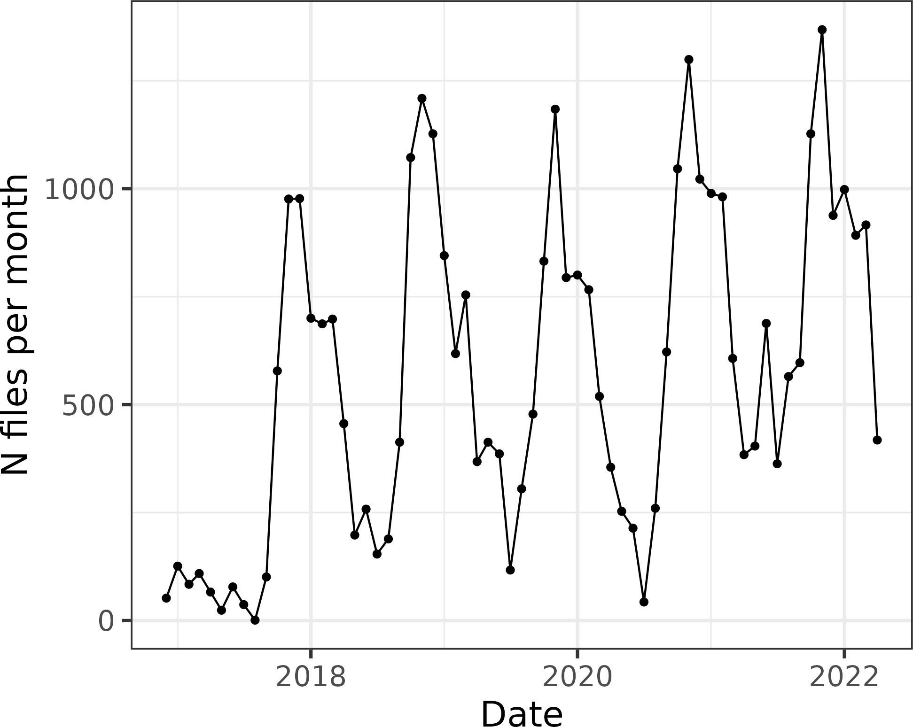

layout: true

<div class="my-footer">
  <div class="my-footer-box"><a href="https://openvolley.org/">openvolley.org</a></div>
  <div class="my-footer-box"><a href="https://https://volleyball.ca/"></a></div>
  <div class="my-footer-box"><a href="https://untan.gl/"></a></div>
</div>

---

```{r setup, include=FALSE}
options(htmltools.dir.version = FALSE)
options(knitr.kable.NA="")
knitr::opts_chunk$set(echo = TRUE, warning = FALSE, message = FALSE, cache = FALSE, dpi = 120, comment = "")
library(dplyr)
library(knitr)
library(ggplot2)
library(datavolley)
options(tibble.width = 65, tibble.print_max = 10, tibble.print_min = 10, width = 80)

```

```{r xaringanExtra-clipboard, echo=FALSE}
xaringanExtra::use_clipboard()
#xaringanExtra::use_panelset()
```

class: inverse, logo, center


## Session 2: The R datavolley package

### Ben Raymond, Adrien Ickowicz

##### with valuable contributions from many others...


---

## What are we going to talk about

- reading datavolley files into R

  - the structure of the data

- error-checking your scout files

- basic analyses

  - general principles

- working with multiple matches

- exercises

---
## Session 2 setup

Update your copy of the workshop repo:

If you are in the 'R_Workshop_2022' project, then from the RStudio menu:

`Tools` -> `Version Control` -> `Pull Branches`

Or from the command line in your 'R_Workshop_2022' directory: `git pull`

<br />

Install the datavolley and ovlytics packages if you don't already have them:

```{r eval = FALSE}
install.packages(c("datavolley", "ovlytics")
                 repos = c("https://openvolley.r-universe.dev",
                           "https://cloud.r-project.org"))

```

---

## dvw file structure

Open the `example_data/DE Women 2020/&20191020 SSC Palmber vs Allianz MTV.dvw` file in your text editor.

```{r echo = FALSE}
dvw <- readLines("example_data/DE Women 2020/&20191020 SSC Palmber vs Allianz MTV.dvw")
dvw <- stringi::stri_trans_general(dvw, "latin-ascii")

```

<div style="font-size:12px; height:45vh; overflow:auto; border:1px solid black;">
<tt>
`r paste(dvw, collapse = "<br />")`
</tt>
</div>

---

## dv_read

```{r eval = FALSE}
library(datavolley)
? dv_read

```

```{r eval = FALSE}
Usage
read_dv(
  filename,
  insert_technical_timeouts = TRUE,
  do_warn = FALSE,
  do_transliterate = FALSE,
  encoding = "guess",
  date_format = "guess",
  extra_validation = 2,
  validation_options = list(),
  surname_case = "asis",
  skill_evaluation_decode = "default",
  custom_code_parser,
  metadata_only = FALSE,
  verbose = FALSE,
  edited_meta
)
```

---
## dv_read

```{r}
x <- dv_read("example_data/DE Women 2020/&20191003 SSC Palmber vs Ladies in b.dvw")

```

Print a summary of the match:

```{r}
summary(x)

```

---
## dv_read

Parts:
```{r}
names(x)
```

---
## dv_read

```{r eval = FALSE}
str(x$file_meta)
```
```{r eval = FALSE}
## or in RStudio
View(x$file_meta)
```
```{r echo = FALSE}
str(x$file_meta)
```

---
## dv_read

```{r}
names(x$meta)
```

---
## dv_read

```{r eval = FALSE}
View(x$meta$match)

```

```{r echo = FALSE}
knitr::kable(x$meta$match[, names(x$meta$match)[!grepl("^X", names(x$meta$match))]], row.names = FALSE)

```

---
## dv_read &mdash; Date formats

```{r eval = FALSE}
Usage
read_dv(
  filename,
  insert_technical_timeouts = TRUE,
  do_warn = FALSE,
  do_transliterate = FALSE,
  encoding = "guess",
  `date_format = "guess"`,
  extra_validation = 2,
  validation_options = list(),
  surname_case = "asis",
  skill_evaluation_decode = "default",
  custom_code_parser,
  metadata_only = FALSE,
  verbose = FALSE,
  edited_meta
)
```

---
## dv_read &mdash; Date formats

Look at the file contents for the match date:

```{r}
x$raw[15:16]

```

<br />

Is that the 3rd of October or the 10th of March?

We can force a particular interpretation:

```
x <- dv_read(..., date_format = "mdy")

```

---
## dv_read

```{r eval = FALSE}
View(x$meta$teams)

```

```{r echo = FALSE}
knitr::kable(x$meta$teams[, names(x$meta$teams)[!grepl("^X", names(x$meta$teams))]], row.names = FALSE)

```

---
## dv_read

```{r eval = FALSE}
View(x$meta$players_h)

```

```{r echo = FALSE}
knitr::kable(x$meta$players_h[, names(x$meta$players_h)[!grepl("^X", names(x$meta$players_h))]], row.names = FALSE)
##str(x$meta$players_h)
```

---
## dv_read &mdash; Text encoding

```{r eval = FALSE}
Usage
read_dv(
  filename,
  insert_technical_timeouts = TRUE,
  do_warn = FALSE,
  do_transliterate = FALSE,
  `encoding = "guess"`,
  date_format = "guess",
  extra_validation = 2,
  validation_options = list(),
  surname_case = "asis",
  skill_evaluation_decode = "default",
  custom_code_parser,
  metadata_only = FALSE,
  verbose = FALSE,
  edited_meta
)
```

---
## dv_read &mdash; Text encoding

Normally `dv_read` should guess the correct text encoding used in the file:

```{r}
x$meta$players_h$name[c(1, 12)]

```

<br />

Use `verbose = TRUE` when reading:

```{r message = TRUE}
x <- dv_read("example_data/DE Women 2020/&20191003 SSC Palmber vs Ladies in b.dvw",
             verbose = TRUE)

```

---
## dv_read &mdash; Text encoding

If we get the text encoding wrong:


```{r}
x2 <- dv_read("example_data/DE Women 2020/&20191003 SSC Palmber vs Ladies in b.dvw",
              encoding = "iso-8859-8")
x2$meta$players_h$name[c(1, 12)]

```

---
## dv_read &mdash; Text encoding

TL/DR: if you have weird characters in player or team names, check the encoding used:

```{r eval = FALSE}
x <- dv_read("myfile.dvw", verbose = TRUE)

```

And force `dv_read` to use the correct encoding:

```{r eval = FALSE}
x <- dv_read("myfile.dvw", encoding = "whatever")

```

Optionally [submit a GitHub issue](https://github.com/openvolley/datavolley/issues) with your dvw file and we'll try and fix `dv_read` to accommodate it.

(You can also check

```{r eval = FALSE}
x$meta$match$text_encoding

```

and the output of `iconvlist()` for  list of possible encodings.)

---
## dv_read &mdash; Skill evaluations

```{r eval = FALSE}
Usage
read_dv(
  filename,
  insert_technical_timeouts = TRUE,
  do_warn = FALSE,
  do_transliterate = FALSE,
  encoding = "guess",
  date_format = "guess",
  extra_validation = 2,
  validation_options = list(),
  surname_case = "asis",
  `skill_evaluation_decode = "default"`,
  custom_code_parser,
  metadata_only = FALSE,
  verbose = FALSE,
  edited_meta
)
```

---
## dv_read &mdash; Skill evaluations

What does a `B/` scout code mean?

--

- invasion (blocking fault)?

- attack kill off hands?

- poor block back to the opposition?

- something else?

<br />

- inconsistent between scouts, across files

- don't want to rely on this, particularly for multi-match analyses

---
## dv_read &mdash; Skill evaluations

```{r}
plays(x) %>% count(skill, evaluation_code, evaluation)

```

---
## dv_read &mdash; Skill evaluations

- translation from `evaluation_code` to `evaluation` is governed by the `skill_evaluation_decode` parameter to `dv_read`

- current options are

  - `"default"` (per the DV manual)
  - `"volleymetrics"`
  - `"german"`
  - or you can provide your own custom function

<br />

- look again at the breakdown in the previous slide, using the `"default"` conventions

---
## dv_read &mdash; Skill evaluations

```{r}
x <- dv_read("example_data/DE Women 2020/&20191003 SSC Palmber vs Ladies in b.dvw",
             skill_evaluation_decode = "german")

plays(x) %>% count(skill, evaluation_code, evaluation)

```


---
## dv_read &mdash; File validation

```{r, eval = FALSE}
View(x$messages)

```

```{r echo = FALSE}
knitr::kable(x$messages[c(1, 2, 13, 66), ], row.names = FALSE)

```

---
## dv_read &mdash; File validation

See also: https://apps.untan.gl/dvalidate

~500 files / month, ~37k files total so far

<br />




---
## dv_read &mdash; Match result

```{r eval = FALSE}
View(x$meta$result)

```

```{r echo = FALSE}
knitr::kable(x$meta$result, row.names = FALSE)

```


---
## dv_read &mdash; The play-by-play data

```{r}
px <- plays(x)

```

- `names(plays(x))`

- `inspect(plays(x))`

---
## Play-by-play data &mdash; Identifiers

- `match_id` uniquely identifies the match


- `set_number` is the set number (1&ndash;5) within a match. If you want to uniquely identify a particular set (from amongst many matches) use the combination of `match_id` and `set_number`


- `point_id` identifies the rally number (point) within a match. Each rally (point) begins with a serve (or rotation fault). Timeouts and other non-action points might have their own `point_id`, so don't rely on `point_id` values being consecutive from one rally to the next. `point_id` values are only unique within a match (so e.g. two different matches will both have a point with `point_id` value of 1

---
## Play-by-play data &mdash; Identifiers

- `team_touch_id` identifies the touches that a team makes while the ball is on their side of the net. So a serve will have a certain `team_touch_id`, then the reception, set, and attack made by the receiving team will all have the same `team_touch_id` (different to the serve's `team_touch_id`). The following block, dig, set, and attack will have another `team_touch_id`, and so on. `team_touch_id` values are also only unique within a match


- the `phase` column identifies the phase of play: it can take the values `Serve`, `Reception`, or `Transition`. Note that a block made against a reception attack (the attack made by the receiving team immediately after receiving the serve) is considered to be `Reception` phase, but the dig made by the blocking team immediately after that (and every subsequent action in the rally) are `Transition`

---
## Play-by-play data &mdash; more variables

```{r eval = FALSE}
install.packages("ovlytics",
                 repos = c("https://openvolley.r-universe.dev",
                           "https://cloud.r-project.org"))

```

```{r eval = FALSE}
library(ovlytics)

px <- ov_augment_plays(px, to_add = "all")

```
Adds these columns:

```{r echo = FALSE}
library(ovlytics)

px <- plays(x)
old_names <- names(px)
px <- ov_augment_plays(px, to_add = "all")
setdiff(names(px), old_names)

```

---
## Analyses &mdash; General principles

Translating data into information

- what might we want to know about a particular skill/facet of the game?

- what data do we therefore need to collect?

- who is the intended audience?

- what analysis techniques might we use, what statistics/summaries might we generate?

---
## Analyses &mdash; General principles

Basis of reporting, e.g.

- attack kills per set?

- attack kills per 50 rallies played?

- kills per 100 attempts (attack kill percentage)?

---
## Analyses &mdash; General principles

- identifying teams

  - `team` (name) and `team_id`
  - (also `serving_team`, `home_team`, `home_team_id`, `visiting_team`, `visiting_team_id`, etc)

- identifying players

  - `player_number`
  - `player_id`
  - `player_name`
  - (also `home_p1`, `home_player_id1`, etc)

---
## Analyses &mdash; General principles

Skill outcomes: use `evaluation` rather than `evaluation_code` where possible

For example, find block faults by

```{r eval = FALSE}
px %>% dplyr::filter(skill == "Block" & evaluation == "Invasion")

```

rather than by

```{r eval = FALSE}
px %>% dplyr::filter(skill == "Block" & evaluation_code == "/")

```


---
## Working with multiple matches

- consistent team IDs, names, player IDs, names, numbers

- find name or ID variants using e.g. `count` or `distinct`

- renaming teams and players

  - edit the dvw files directly, then reload into R

  - or use `remap_team_names` and `remap_player_names` in R

---
## R &mdash; Exercises

Open `s2-exercises.Rmd` in Rstudio

