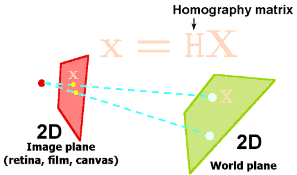

layout: true

<div class="my-footer">
  <div class="my-footer-box"><a href="https://openvolley.org/">openvolley.org</a></div>
  <div class="my-footer-box"><a href="https://https://volleyball.ca/"></a></div>
  <div class="my-footer-box"><a href="https://untan.gl/"></a></div>
</div>

---

```{r xaringanExtra-clipboard, echo=FALSE}
xaringanExtra::use_clipboard()
xaringanExtra::use_panelset()
```

```{r setup, include=FALSE}
options(htmltools.dir.version = FALSE)
options(knitr.kable.NA="")
knitr::opts_chunk$set(echo = FALSE, warning = FALSE, message = FALSE, cache = FALSE, dpi = 120)
library(dplyr)
library(formattable)
library(ggplot2)
library(ggsci)
library(datavolley)
library(ovdata)
`%eq%` <- function(x,y) x==y & !is.na(x) & !is.na(y)

```

class: inverse, logo, center


## Session 3: Advanced reports

### Adrien Ickowicz, Ben Raymond

##### with valuable contributions from many others...

---

## What are we going to talk about

- create tables with R
- using <span class="Rpkg">rmarkdown</span>
  -the <span class="pkg">volleyreport</span> package
- volleyball-specific plots (court plots and other)
- plotting transformation from image space to court space
  - overlaying plots onto image
- the <span class="pkg">ovva</span> and <span class="pkg">ovideo</span> packages:
  - saving playlists to CSV
  - creating your own playlists directly with `ov_video_playlist`
  - viewing them with `ovplayer`
  - sharing them with `ov_playlist_to_html` or the `ov_editry_clips` functions
  - the Science Untangled app for this

---

## Create tables in R

* What kind of tables can you create using R: https://community.rstudio.com/c/table-gallery/64
* A number of packages are available: <span class="Rpkg">DT</span>, <span class="Rpkg">gt</span>, <span class="Rpkg">reactable</span> ...
* Let's focus on  <span class="Rpkg">kableExtra</span> (for its html capabilities)
  * Need to install it
  * Try it
  * Then the sky is the limit

.panelset[
.panel[.panel-name[R Code]

```{r example table, echo = TRUE, eval = FALSE}
library(datavolley)
library(kableExtra)
dvw <- dv_read(dv_example_file())
kable(head(plays(dvw)[,c('code', "player_name", 'skill')]))
```

]

.panel[.panel-name[HTML output]

```{r example table output html, echo = FALSE}
dvw <- dv_read(dv_example_file())
kableExtra::kable(head(datavolley::plays(dvw)[,c('code', "player_name", 'skill')]))
```

]

]


---


## Create tables in R

.panelset[

.panel[.panel-name[Try it!]

Create a table with your own data, and share it!

]

.panel[.panel-name[My R Code]

```{r exercise table, echo = TRUE, eval = FALSE}
library(dplyr)
library(tidyr)
library(stringr)
library(kableExtra)
dvw$meta$teams %>% dplyr::select(.data$team, .data$sets_won) %>%
        dplyr::rename(Teams = "team", 'Final score' = "sets_won") %>%
        kable(format = 'html', escape = FALSE, col.names = c("MATCH RESULT", ""), 
              table.attr = "class=\"widetable\"") %>% 
  kable_styling(bootstrap_options = c("striped", "hover"), 
                full_width = TRUE, font_size = 15) %>%
        row_spec(1:2, bold = TRUE) %>%
        row_spec(0, bold = TRUE, color = "white", background = "black" ) %>%
        column_spec(1, border_left = "grey") %>%
        column_spec(2, border_right = "grey") %>%
        row_spec(2, extra_css = paste0("border-bottom:", "grey"))
```

]

.panel[.panel-name[My HTML output]

```{r exercise table res, echo = FALSE, eval = TRUE}
library(dplyr)
library(tidyr)
library(stringr)
library(kableExtra)
dvw$meta$teams %>% dplyr::select(.data$team, .data$sets_won) %>%
        dplyr::rename(Teams = "team", 'Final score' = "sets_won") %>%
        kable(format = 'html', escape = FALSE, col.names = c("MATCH RESULT", ""), 
              table.attr = "class=\"widetable\"") %>% 
  kable_styling(bootstrap_options = c("striped", "hover"), 
                full_width = TRUE, font_size = 15) %>%
        row_spec(1:2, bold = TRUE) %>%
        row_spec(0, bold = TRUE, color = "white", background = "black" ) %>%
        column_spec(1, border_left = "grey") %>%
        column_spec(2, border_right = "grey") %>%
        row_spec(2, extra_css = paste0("border-bottom:", "grey"))
```

]
]

---


## Using rmarkdown

R Markdown is a format for writing reproducible, dynamic reports with R. Use it to embed R code and results into slideshows, pdfs, html documents, Word files and more. Examples:

* The current presentation!

* .Rmd files
  * Let's open one and check what's in it...
  * It has its own grammar again!
  
---

## Using rmarkdown

* outputs from  <span class="pkg">volleyreport</span>

```{r report example, echo = TRUE, eval = FALSE}
library(volleyreport)
vr <- vr_match_summary(dvw, format = "paged_png", vote = FALSE)
browseURL(vr)
```

---

## Volleyball specfic plots

.panelset[
.panel[.panel-name[Court]
```{r court, echo = FALSE, eval = TRUE, out.height='400px'}
ggplot() + ggcourt(labels = NULL, show_zones = FALSE) + theme_bw()
```
]
.panel[.panel-name[Court - zones]
```{r court_zones, echo = FALSE, eval = TRUE, out.height='400px'}
library(ggplot2)
library(dplyr)
x <- dv_read(dv_example_file(1))
## calculate attack frequency by zone, per team
px <- plays(x)
attack_rate <- px %>% dplyr::filter(skill == "Attack") %>%
    group_by(team, start_zone) %>% dplyr::summarize(n_attacks = n()) %>%
    mutate(rate = n_attacks/sum(n_attacks)) %>% ungroup
## add x, y coordinates associated with the zones
attack_rate <- cbind(attack_rate, dv_xy(attack_rate$start_zone, end = "lower"))
## additionally specify the subzone to dv_xy if you want to plot by subzone (and your data
##   were scouted with subzones)
## for team 2, these need to be on the top half of the diagram
tm2i <- attack_rate$team == teams(x)[2]
attack_rate[tm2i, c("x", "y")] <- dv_flip_xy(attack_rate[tm2i, c("x", "y")])
ggplot(attack_rate, aes(x, y, fill = rate)) + geom_tile() + ggcourt(labels = teams(x)) +
    scale_fill_gradient2(name = "Attack rate")
```
]
.panel[.panel-name[Court - cones]
```{r court_cones, echo = FALSE, eval = TRUE, out.height='400px'}
x <- dv_read(ovdata_example("190301_kats_beds"))
px <- plays(x)
## select left-side (X5) attacks
attack_rate <- px %>% dplyr::filter(attack_code == "X5") %>%
    group_by(start_zone, end_cone) %>% dplyr::summarize(n_attacks = n()) %>%
    mutate(rate = n_attacks/sum(n_attacks)) %>% ungroup
## add starting locations
attack_rate <- bind_cols(attack_rate, dv_xy(attack_rate$start_zone, end = "lower"))
## and end locations
attack_rate <- bind_cols(attack_rate, dv_cone2xy(start_zones = attack_rate$start_zone,
                                                 end_cones = attack_rate$end_cone, end = "upper"))
ggplot(attack_rate, aes(x, y, xend = ex, yend = ey, colour = rate, size = rate)) +
    ggcourt(labels = NULL) +
    geom_segment(arrow = arrow(length = unit(2, "mm"), type = "closed", angle = 20)) +
    scale_colour_distiller(palette = "OrRd", direction = 1, name = "Attack rate") +
    guides(size = "none") 

```
]
.panel[.panel-name[Court - cones (ctd)]
```{r court_cones2, echo = FALSE, eval = TRUE, out.height='400px'}
cxy <- dv_cone2xy(start_zones = attack_rate$start_zone, end_cones = attack_rate$end_cone,
                      as = "polygons")
## this returns coordinates as list columns, unpack these to use with ggplot
##  also add an identifier for each polygon
cxy <- data.frame(cx = unlist(cxy$ex), cy = unlist(cxy$ey),
                  id = unlist(lapply(seq_len(nrow(cxy)), rep, 4)))
attack_rate <- attack_rate %>% mutate(id = row_number()) %>% left_join(cxy, by = "id")
ggplot(attack_rate, aes(cx, cy, group = id, fill = rate)) +
    ggcourt(labels = NULL) +
    geom_polygon() +
    scale_fill_distiller(palette = "OrRd", direction = 1, name = "Attack rate") 

```
]
]

---

## Volleyball specfic plots

.panelset[
.panel[.panel-name[Court]
```{r court_code, echo = TRUE, eval = FALSE}
ggplot() + ggcourt(labels = NULL, show_zones = FALSE) + theme_bw()
```
]
.panel[.panel-name[Court - zones]
```{r court_zones_code, echo = TRUE, eval = FALSE}
library(ggplot2)
library(dplyr)
x <- dv_read(dv_example_file(1))
## calculate attack frequency by zone, per team
px <- plays(x)
attack_rate <- px %>% dplyr::filter(skill == "Attack") %>%
    group_by(team, start_zone) %>% dplyr::summarize(n_attacks = n()) %>%
    mutate(rate = n_attacks/sum(n_attacks)) %>% ungroup
## add x, y coordinates associated with the zones
attack_rate <- cbind(attack_rate, dv_xy(attack_rate$start_zone, end = "lower"))
## additionally specify the subzone to dv_xy if you want to plot by subzone (and your data
##   were scouted with subzones)
## for team 2, these need to be on the top half of the diagram
tm2i <- attack_rate$team == teams(x)[2]
attack_rate[tm2i, c("x", "y")] <- dv_flip_xy(attack_rate[tm2i, c("x", "y")])
ggplot(attack_rate, aes(x, y, fill = rate)) + geom_tile() + ggcourt(labels = teams(x)) +
    scale_fill_gradient2(name = "Attack rate")
```
]
.panel[.panel-name[Court - cones]
```{r court_cones_code, echo = TRUE, eval = FALSE}
x <- dv_read(ovdata_example("190301_kats_beds"))
px <- plays(x)
## select left-side (X5) attacks
attack_rate <- px %>% dplyr::filter(attack_code == "X5") %>%
    group_by(start_zone, end_cone) %>% dplyr::summarize(n_attacks = n()) %>%
    mutate(rate = n_attacks/sum(n_attacks)) %>% ungroup
## add starting locations
attack_rate <- bind_cols(attack_rate, dv_xy(attack_rate$start_zone, end = "lower"))
## and end locations
attack_rate <- bind_cols(attack_rate, dv_cone2xy(start_zones = attack_rate$start_zone,
                                                 end_cones = attack_rate$end_cone, end = "upper"))
ggplot(attack_rate, aes(x, y, xend = ex, yend = ey, colour = rate, size = rate)) +
    ggcourt(labels = NULL) +
    geom_segment(arrow = arrow(length = unit(2, "mm"), type = "closed", angle = 20)) +
    scale_colour_distiller(palette = "OrRd", direction = 1, name = "Attack rate") +
    guides(size = "none")

```
]
.panel[.panel-name[Court - cones (ctd)]
```{r court_cones2_code, echo = TRUE, eval = FALSE}
cxy <- dv_cone2xy(start_zones = attack_rate$start_zone, end_cones = attack_rate$end_cone,
                      as = "polygons")
## this returns coordinates as list columns, unpack these to use with ggplot
##  also add an identifier for each polygon
cxy <- data.frame(cx = unlist(cxy$ex), cy = unlist(cxy$ey),
                  id = unlist(lapply(seq_len(nrow(cxy)), rep, 4)))
attack_rate <- attack_rate %>% mutate(id = row_number()) %>% left_join(cxy, by = "id")
ggplot(attack_rate, aes(cx, cy, group = id, fill = rate)) +
    ggcourt(labels = NULL) +
    geom_polygon() +
    scale_fill_distiller(palette = "OrRd", direction = 1, name = "Attack rate") 

```
]
]

---

## Volleyball specfic plots - heatmaps

.panelset[
.panel[.panel-name[Data pts]
```{r data_pts, echo = FALSE, eval = TRUE, out.height='400px'}
Na <- 20
set.seed(17)
px2 <- tibble(skill = "Attack", end_coordinate_x = c(runif(Na, min = 0.4, max = 1.2), runif(Na, min = 2, max = 3)),
            end_coordinate_y = c(runif(Na, min = 4.5, max = 6.6), runif(Na, min = 4.9, max = 6.6)))

ggplot(px2 %>% dplyr::filter(skill == "Attack"), aes(end_coordinate_x, end_coordinate_y)) +
  ggcourt(labels = NULL, court = "upper") +
  geom_point(colour = "dodgerblue")
```
]
.panel[.panel-name[Heatmap]
```{r htmp, echo = FALSE, eval = TRUE, out.height='400px'}
hx <- ovlytics::ov_heatmap_kde(px2 %>% dplyr::filter(skill == "Attack") %>% dplyr::select(end_coordinate_x, end_coordinate_y),
                     resolution = "coordinates", court = "upper")
## then plot it
ggplot(hx, aes(x, y, fill = density)) +
    scale_fill_distiller(palette = "Spectral", guide = "none") +
    geom_raster() +
    ggcourt(labels = NULL, court = "upper") ## plot the court last, so that the lines overlay the heatmap

```
]
.panel[.panel-name[Heatmap - precision]
```{r htmp_p, echo = FALSE, eval = TRUE, out.height='400px'}
ggplot(px2 %>% dplyr::filter(skill == "Attack"), aes(end_coordinate_x, end_coordinate_y)) +
  stat_density_2d(geom = "raster", aes_string(fill = "..density.."), contour = FALSE, h = 0.85, n = c(60, 120)) +
  scale_fill_distiller(palette = "Spectral", guide = "none") +
  ggcourt(labels = NULL, court = "upper")
```
]
]

---

## Volleyball specfic plots - heatmaps

.panelset[
.panel[.panel-name[Data pts]
```{r data_pts_code, echo = TRUE, eval = FALSE}
Na <- 20
set.seed(17)
px2 <- tibble(skill = "Attack", end_coordinate_x = c(runif(Na, min = 0.4, max = 1.2), runif(Na, min = 2, max = 3)),
            end_coordinate_y = c(runif(Na, min = 4.5, max = 6.6), runif(Na, min = 4.9, max = 6.6)))

ggplot(px2 %>% dplyr::filter(skill == "Attack"), aes(end_coordinate_x, end_coordinate_y)) +
  ggcourt(labels = NULL, court = "upper") +
  geom_point(colour = "dodgerblue")
```
]
.panel[.panel-name[Heatmap]
```{r htmp_code, echo = TRUE, eval = FALSE}
hx <- ovlytics::ov_heatmap_kde(px2 %>% dplyr::filter(skill == "Attack") %>% dplyr::select(end_coordinate_x, end_coordinate_y),
                     resolution = "coordinates", court = "upper")
## then plot it
ggplot(hx, aes(x, y, fill = density)) +
    scale_fill_distiller(palette = "Spectral", guide = "none") +
    geom_raster() +
    ggcourt(labels = NULL, court = "upper") ## plot the court last, so that the lines overlay the heatmap
```
]
.panel[.panel-name[Heatmap - precision]
```{r htmp_p_code, echo = TRUE, eval = FALSE}
ggplot(px2 %>% dplyr::filter(skill == "Attack"), aes(end_coordinate_x, end_coordinate_y)) +
  stat_density_2d(geom = "raster", aes_string(fill = "..density.."), contour = FALSE, h = 0.85, n = c(60, 120)) +
  scale_fill_distiller(palette = "Spectral", guide = "none") +
  ggcourt(labels = NULL, court = "upper")
```
]
]

---

## Volleyball specfic plots - misc

.panelset[
.panel[.panel-name[Posture]
 
]
.panel[.panel-name[R Code]
```{r passing_posture, eval = FALSE, echo = TRUE}
library(png)
img <- readPNG('extra/man-volleyball-passing.png')
g <- grid::rasterGrob(img, interpolate=TRUE)

ggplot() +
  annotation_custom(g, xmin=-Inf, xmax=Inf, ymin=-Inf, ymax=Inf) +
  geom_point()
```
]

]

---

## Plotting transformations

.pull-left[
* What is the image space?
* What is the court space?
* What is a 2D homography?

 
Resource: https://en.wikipedia.org/wiki/Camera_matrix
]
.pull-right[
 
]

* Check out <span class="pkg">ovideo</span>


---

## Overlaying plots onto court images

1. Create an empty court image
2. Identify the stats to be displayed
3. Create the shape of interest, and project them
4. Plot the ensemble

.panelset[

.panel[.panel-name[R Code]
```{r rcode_plot_transfo, echo = TRUE, eval = FALSE}
imref <- system.file("extdata/2019_03_01-KATS-BEDS-court.jpg", package = "ovideo")
## fake distribution data
dx <- tribble(~start_zone, ~percent,
              4, 35,
              3, 20,
              2, 30,
              8, 15)
## xy start zone coords
dx <- cbind(dx, datavolley::dv_xy(dx$start_zone))
```
]
.panel[.panel-name[R Code (ctd)]
```{r rcode_plot_transfo1, echo = TRUE, eval = FALSE}

## the court reference
crt <- data.frame(image_x = c(0.05397063, 0.95402573, 0.75039756, 0.28921230),
                  image_y = c(0.02129301, 0.02294600, 0.52049712, 0.51884413),
                  court_x = c(0.5, 3.5, 3.5, 0.5),
                  court_y = c(0.5, 0.5, 6.5, 6.5))
image_wh <- c(1280, 720)
## create polygons to plot in image space
dx <- dx %>% group_by(start_zone, percent) %>% dplyr::summarize(x = x + c(-0.5, 0.5, 0.5, -0.5, -0.5), y = y + c(-0.5, -0.5, 0.5, 0.5, -0.5), .groups = "drop")
dx <- cbind(dx, setNames(ovideo::ov_transform_points(dx[, c("x", "y")], ref = crt, direction = "to_image"), c("ix", "iy")))
dx <- dx %>% mutate(ix = ix * image_wh[1], iy = iy * image_wh[2])
```
]
.panel[.panel-name[R Code (ctd)]
```{r rcode_plot_transfo2, echo = TRUE, eval = FALSE}
ggplot2::ggplot(dx) +
    ## background image
    ggplot2::annotation_custom(grid::rasterGrob(jpeg::readJPEG(imref)), xmin = 0, xmax = image_wh[1], ymin = 0, ymax = image_wh[2]) +
    ## distribution polygons
    geom_polygon(aes(x = ix, y = iy, group = start_zone, fill = percent)) +
    ## finish off
    scale_fill_distiller(palette = "Purples", direction = 1, name = "%") +
    ggplot2::coord_fixed(xlim = c(0, image_wh[1]), ylim = c(0, image_wh[2])) + ggplot2::theme_void()

```
]

.panel[.panel-name[Image]

```{r rcode_plot_transfo image, echo = FALSE, eval = TRUE, out.width = '200px'}
imref <- system.file("extdata/2019_03_01-KATS-BEDS-court.jpg", package = "ovideo")
im <- system.file("extdata/2019_03_01-KATS-BEDS-frame.png", package = "ovideo")
imdiff <- "extra/2019_03_01-KATS-BEDS-frame-difference.png"

## fake distribution data
dx <- tribble(~start_zone, ~percent,
              4, 35,
              3, 20,
              2, 30,
              8, 15)

## xy start zone coords
dx <- cbind(dx, datavolley::dv_xy(dx$start_zone))

## the court reference
crt <- data.frame(image_x = c(0.05397063, 0.95402573, 0.75039756, 0.28921230),
                  image_y = c(0.02129301, 0.02294600, 0.52049712, 0.51884413),
                  court_x = c(0.5, 3.5, 3.5, 0.5),
                  court_y = c(0.5, 0.5, 6.5, 6.5))


image_wh <- c(1280, 720)

## create polygons to plot in image space
dx <- dx %>% group_by(start_zone, percent) %>% dplyr::summarize(x = x + c(-0.5, 0.5, 0.5, -0.5, -0.5), y = y + c(-0.5, -0.5, 0.5, 0.5, -0.5), .groups = "drop")
dx <- cbind(dx, setNames(ovideo::ov_transform_points(dx[, c("x", "y")], ref = crt, direction = "to_image"), c("ix", "iy")))
dx <- dx %>% mutate(ix = ix * image_wh[1], iy = iy * image_wh[2])

ggplot2::ggplot(dx) +
    ## background image
    ggplot2::annotation_custom(grid::rasterGrob(jpeg::readJPEG(imref)), xmin = 0, xmax = image_wh[1], ymin = 0, ymax = image_wh[2]) +
    ## distribution polygons
    geom_polygon(aes(x = ix, y = iy, group = start_zone, fill = percent)) +
    ## diff image on top (players)
    ggplot2::annotation_custom(grid::rasterGrob(png::readPNG(imdiff)), xmin = 0, xmax = image_wh[1], ymin = 0, ymax = image_wh[2]) +
    ## finish off
    scale_fill_distiller(palette = "Purples", direction = 1, name = "%") +
    ggplot2::coord_fixed(xlim = c(0, image_wh[1]), ylim = c(0, image_wh[2])) + ggplot2::theme_void()

```
]
]

---

## Overlaying plots onto court images

.panelset[

.panel[.panel-name[Your turn!]

* Install <span class="pkg">volleyreport</span>
* Use it to create the vizualization you'd like:
  * `ov_video_frame` extract frame from video
  * `ov_shiny_court_ref` helps you define the projection
  * other functions from other packages
]
.panel[.panel-name[Example code]

```{r projection_exercise, echo = TRUE, eval = FALSE}
video_file = "~/Documents/Donnees/VolleyBall/Dropbox/server_videos/Southern League 2022 Women - Autumn Videos/2022_04_11W-VIK_vs_UTAS.M4V"
img_ref = ovideo::ov_video_frame(video_file, t = 100)
ref <- ovideo::ov_shiny_court_ref(img_ref)
image_wh <- c(1280, 720)
## create polygons to plot in image space
dx <- tribble(~start_zone, ~percent,4, 35,  3, 20,2, 30,8, 15)
## xy start zone coords
dx <- cbind(dx, datavolley::dv_xy(dx$start_zone))
dx <- dx %>% group_by(start_zone, percent) %>% dplyr::summarize(x = x + c(-0.5, 0.5, 0.5, -0.5, -0.5), y = y + c(-0.5, -0.5, 0.5, 0.5, -0.5), .groups = "drop")
dx <- cbind(dx, setNames(ovideo::ov_transform_points(dx[, c("x", "y")], ref = ref$court_ref, direction = "to_image"), c("ix", "iy")))
dx <- dx %>% mutate(ix = ix * image_wh[1], iy = iy * image_wh[2])
ggplot2::ggplot(dx) +
    ggplot2::annotation_custom(grid::rasterGrob(jpeg::readJPEG(img_ref)), xmin = 0, xmax = image_wh[1], ymin = 0, ymax = image_wh[2]) +
    geom_polygon(aes(x = ix, y = iy, group = start_zone, fill = percent), alpha = 0.5) +
    scale_fill_distiller(palette = "Purples", direction = 1, name = "%") +
    ggplot2::coord_fixed(xlim = c(0, image_wh[1]), ylim = c(0, image_wh[2])) + ggplot2::theme_void()
```

]
.panel[.panel-name[Example output]


]

]
---

## Working with videos

What can we do with videos?
  * Create playlists
  * Saving playlists to csv
  * Share playlists with <span class="pkg">ovplayer</span>
  * Share palylists as objects
  * More ? SU's <span class="pkg">ovva</span>, <span class="pkg">volleyspike</span>...

---

## Working with videos

Function #1: `ov_video_playlist()`:

.panelset[

.panel[.panel-name[Create playlist]
```{r example video, eval=FALSE, echo = TRUE}
library(ovideo)
x <- datavolley::dv_read(filename = "&180527 iri jpn.dvw")
dv_meta_video(x) <- "NisDpPFPQwU"
## extract play-by-play data
px <- datavolley::plays(x)
px$video_time 
## find pipe (XP) attacks in transition
px <- px[which(px$attack_code == "XP" & px$phase == "Transition"), ]
## create playlist
ply <- ov_video_playlist(px, x$meta, timing = ov_video_timing())
## with custom timing
ply <- ov_video_playlist(px, x$meta,
  timing = ov_video_timing_df(data.frame(skill = "Attack", phase = "Transition",
                              start_offset = -5, duration = 10, stringsAsFactors = FALSE)))
```
]

.panel[.panel-name[Then what?]
```{r video_ply_share, eval = FALSE, echo = TRUE}
# To ovplayer:
shinyApp(
      ui = fluidPage(
          ov_video_js(youtube = TRUE, version = 2),
          ov_video_player(id = "yt_player", type = "youtube",
                          version = 2, controller_var = "my_dv",
                          style = "height: 480px; background-color: black;",
                          controls = tags$button("Go",
                                     onclick = ov_playlist_as_onclick(ply, "yt_player",
                                                                      controller_var = "my_dv")))
      ),
      server = function(input, output) {},
  )

```
]

.panel[.panel-name[Html share]
```{r video_ply_share_html, eval = FALSE, echo = TRUE}
  extra_cols <- c("home_team", "visiting_team", "video_time", "code", "set_number", "home_team_score", "visiting_team_score")
  ## make the playlist with extra columns included
  ply <- ov_video_playlist(px, x$meta, extra_cols = c(extra_cols, "player_name"))
  ## use player name as the subtitle
  ply$subtitle <- ply$player_name
  ## convert to HTML
  f <- ov_playlist_to_html(ply, table_cols = extra_cols)
  ## and finally open it!
  browseFile(f)
```
]

]

---

## Working with videos

* Create clips? Create a video highlight:

  * Check out <span class="pkg">ovva</span>,
  * Look into `ov_editry_clip()`
  * Open `s3-create-video-highlight.R` for an example script

---

## Science untangled - videos, tables, communicating efficiently


* https://apps.untan.gl/ovva/
  * Example video

* https://apps.untan.gl/spike-example-R2022/
  * Example for the women's world championship 2018


