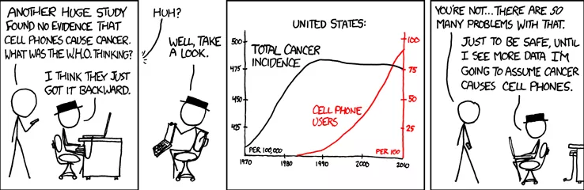

layout: true

<div class="my-footer">
  <div class="my-footer-box"><a href="https://openvolley.org/">openvolley.org</a></div>
  <div class="my-footer-box"><a href="https://https://volleyball.ca/"></a></div>
  <div class="my-footer-box"><a href="https://untan.gl/"></a></div>
</div>

---

```{r xaringanExtra-clipboard, echo=FALSE}
xaringanExtra::use_clipboard()
xaringanExtra::use_panelset()
```

```{r setup, include=FALSE}
options(htmltools.dir.version = FALSE)
options(knitr.kable.NA="")
knitr::opts_chunk$set(echo = FALSE, warning = FALSE, message = FALSE, cache = FALSE, dpi = 120)
library(dplyr)
library(formattable)
library(ggplot2)
library(ggsci)
library(datavolley)
library(ovdata)
`%eq%` <- function(x,y) x==y & !is.na(x) & !is.na(y)

```

class: inverse, logo, center


## Session 4: Advanced analytics

### Ben Raymond, Adrien Ickowicz

##### with valuable contributions from many others...

---

## What are we going to talk about

- Statistical modelling
    - descriptive statistics vs inference
    - Is causality reachable ?
    - Inference via simulation vs Inference via statistical modelling
- Simulating matches
    - the <span class="pkg">volleysim</span> package
    - the <span class="pkg">bandit</span> package
- Statistical (inference-based) models
    - Use the example of the effect of player height on passing performance
    - the effect of serve speed on outcome? Serve error vs breakpoint ?


---

## Statistical modelling
#### descriptive statistics vs inference

From wiki:

A descriptive statistic (in the count noun sense) is a summary statistic that quantitatively describes or summarizes features from a collection of information, while descriptive statistics (in the mass noun sense) is the process of using and analysing those statistics.

Example of descriptive statistics:
* Number of serve errors per set
* Break-point rate per set

Example of inference:
* How do these two quantities relate to one another?

---

## Statistical modelling
#### Causality

 

credit: https://xkcd.com/

---

## Statistical modelling
#### Causality

 

credit: https://xkcd.com/

---

## Statistical modelling
#### Causality and correlation

https://www.tylervigen.com/spurious-correlations

So what is the problem? 

- An increase in the number of people at the beach causes a higher number of ice cream sales
- An increase in the number of people at the beach causes a higher number of shark attacks
- Therefore, people need ice cream for comfort after a shark attack; or is it that sharks attack people after they ate ice cream because they taste better?

---

## Statistical modelling
#### Inference via simulation vs Inference via statistical modelling

When do we use either:
- When the world can be simplified without loss of (too much) information, we can simulate;
    - Example: Can we simplify a volleyball game if we only want to know who is going to win? Anyone has an opinion?
- When the world is too complex, and we have no clue or the process is convoluted, we may want to try something simpler at first;
    - Example: Are tall players better passers than short players?

In a nutshell, when you cannot narrow down the factors that influence the uncertainty to a handy few, forget about simulation.
    
    
---

## Simulating matches
#### the <span class="pkg">volleysim</span> package

---

## Simulating matches
#### the <span class="pkg">bandit</span> package

---

## Do you know...

https://untan.gl/index.html

---

## Statistical models
#### Player height and passing performance

Question: Does height influence the passing quality?

---

## Statistical models
#### Serve agression, speed and outcome

Question 1 : Should we ban serving errors ?

Question 2 : Is there an optimal serve speed for which the expected break-point is maximum ?

---


## Statistical models
#### Setter entropy analysis
