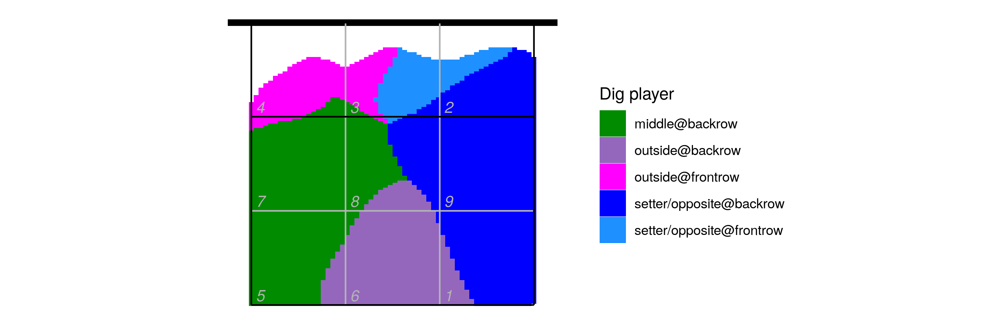
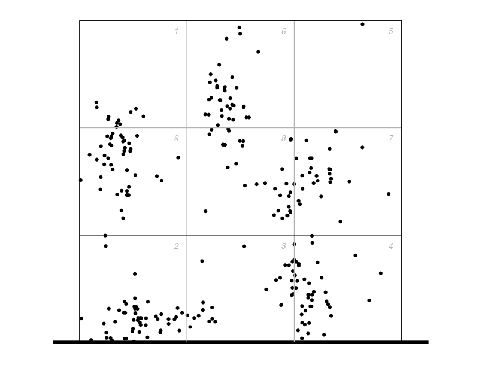
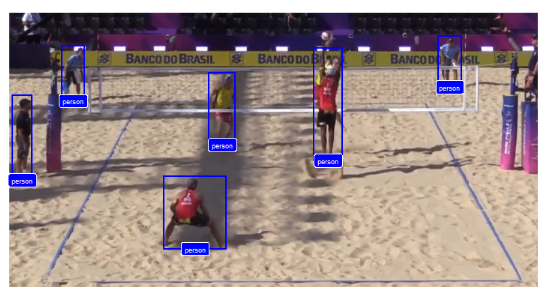
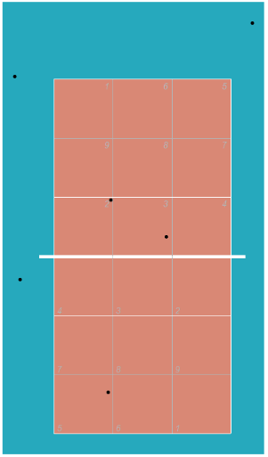
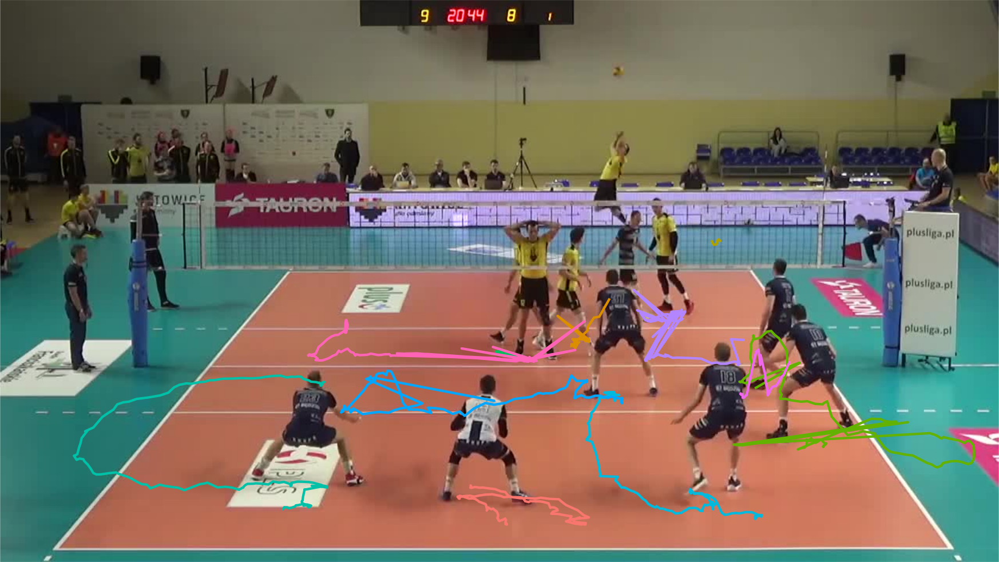
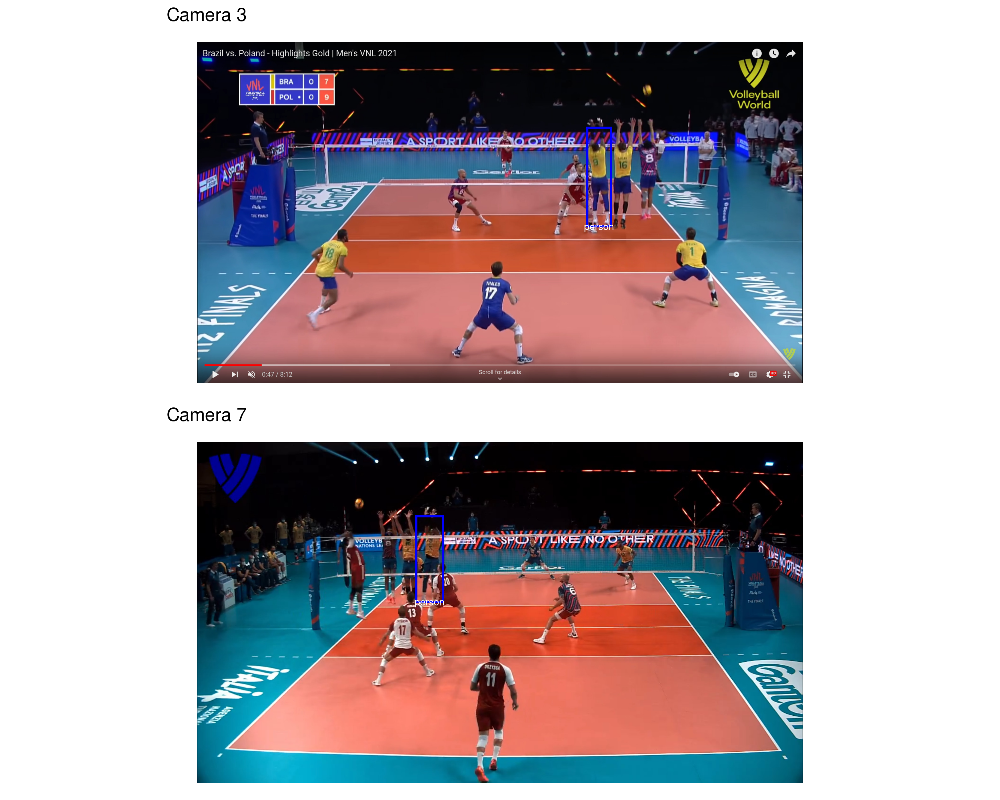
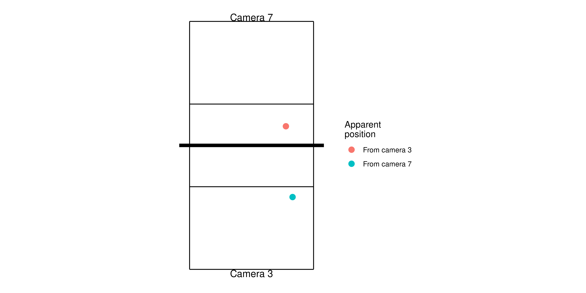
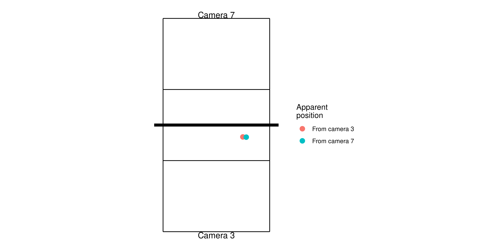

layout: true

<div class="my-footer">
  <div class="my-footer-box"><a href="https://openvolley.org/">openvolley.org</a></div>
  <div class="my-footer-box"><a href="https://https://volleyball.ca/"></a></div>
  <div class="my-footer-box"><a href="https://untan.gl/"></a></div>
</div>

---

```{r setup, include=FALSE}
options(htmltools.dir.version = FALSE)
options(knitr.kable.NA="")
knitr::opts_chunk$set(echo = TRUE, warning = FALSE, message = FALSE, cache = FALSE, dpi = 120, comment = "", fig.height = 4.5)
library(dplyr)
library(knitr)
library(ggplot2)
library(datavolley)
options(tibble.width = 65, tibble.print_max = 10, tibble.print_min = 10, width = 80)
xaringanExtra::use_clipboard()

```

class: inverse, logo, center


## Session 5: Computer vision in R

### Ben Raymond, Adrien Ickowicz

##### with valuable contributions from many others...


---
## Session 5 setup

Update your copy of the workshop repo:

If you are in the 'R_Workshop_2022' project, then from the RStudio menu:

`Tools` -> `Version Control` -> `Pull Branches`

Or from the command line in your 'R_Workshop_2022' directory: `git pull`

<br />

Install the ovml package if you don't already have it:

```{r eval = FALSE}
install.packages("ovml",
                 repos = c("https://openvolley.r-universe.dev",
                           "https://cloud.r-project.org"))

```

---
## Limitations of scout data

- only the player playing the ball

- doesn't capture all details

- unavoidable subjectivity

- manually intensive


---
## A brief history of computer vision, AI and 'deep learning'

#### AI, deep learning:

1940s&ndash;1980s: artificial neural networks, backpropagation

1990s&ndash;2000s: use of GPUs, quantities of data

Around 2010: "modern" computer vision approaches


<br />
<hr />

See also: [Peter Norvig - The Unreasonable Effectiveness of Data](https://www.youtube.com/watch?v=yvDCzhbjYWs)

---
## A biased perspective

For a prospective user of these approaches:

- developing new models is hard

- there are models available (with code), many to choose from

- but they likely don't do quite what (or everything) you want

- training networks is fiddly, time consuming, and requires lots of data ... but likely feasible

- beyond trivial usage, most require domain-specific coding (Python)

---
## Openvolley aims

- to make these approaches more accessible

- in R

- not necessarily the most up-to-date or best (from a ML perspective)

- not necessarily the most efficient implementation

- BUT integrated with all the other openvolley tools

---
## The ovml package

```{r}
library(ovml)

dn <- ovml_yolo()
image_file <- ovml_example_image()
res <- ovml_yolo_detect(dn, image_file)
res

```
---

```{r}
ovml_ggplot(image_file, res)

```

---
## The ovml package

Helpers &mdash; extracting video frames

```{r}
my_video_file <- system.file("extdata/video/2019_03_01-KATS-BEDS-clip.mp4", package = "ovdata")
my_video_file

library(ovideo)
image_file <- ov_video_frame(my_video_file, t = 3.2)

image_file

```

---
## The ovml package

Helpers &mdash; converting to court coordinates

Also in the ovideo package:

- `ov_shiny_court_ref` to define the transformation function

- `ov_transform_points` to transform from image coordinates to court coordinates and vice-versa

---
## The ovml package

Helpers &mdash; converting to court coordinates

```{r eval = FALSE}
ref <- ov_shiny_court_ref(image_file)
ref$court_ref
```

```{r echo = FALSE}
crt <- data.frame(image_x = c(0.05397063, 0.95402573, 0.75039756, 0.28921230),
                  image_y = c(0.02129301, 0.02294600, 0.52049712, 0.51884413),
                  court_x = c(0.5, 3.5, 3.5, 0.5),
                  court_y = c(0.5, 0.5, 6.5, 6.5))
ref <- list(court_ref = crt)
ref$court_ref

```

---
## The ovml package

Helpers &mdash; putting those together

```{r}

res <- ovml_yolo_detect(dn, image_file)
head(res)

```

---
## The ovml package

Helpers &mdash; putting those together

```{r}
library(magick)
image_meta <- image_info(image_read(image_file))

res <- res %>% mutate(x = (xmin + xmax) / 2 / image_meta$width,
                      y = ymin / image_meta$height)
head(res)
```

---
## The ovml package

```{r}
court_xy <- ov_transform_points(res[, c("x", "y")],
                                ref = ref$court_ref,
                                direction = "to_court")
res <- bind_cols(res, setNames(court_xy, c("court_x", "court_y")))
head(res)

```

---
## The ovml package

Helpers &mdash; putting those together

```{r eval = FALSE}
ggplot(res %>% filter(court_y < 7 & court_x < 4),
       aes(x = court_x, y = court_y)) +
    ggcourt(labels = NULL) +
    geom_point()

```


```{r echo = FALSE, fig.width = 6, fig.height = 3}
library(patchwork)
p1 <- ovml_ggplot(image_file, res, label_geom = NULL)
p2 <- ggplot(res %>% filter(court_y < 7 & court_x < 4),
             aes(x = court_x, y = court_y)) +
    ggcourt(labels = NULL) +
    geom_point(color = "blue")
p2 + p1 + plot_layout(ncol = 2)

```

---
## ovml &mdash; Application ideas

#### Court positioning

Recall from yesterday, the volleydef app output:



- uses one defender position per dug attack

- what can we get via ovml?

---
## ovml &mdash; Court positioning

```{r}
library(datavolley)
library(ovdata)
dv <- ovdata_example("190301_kats_beds-clip", as = "parsed")

vt <- plays(dv) %>%
    filter(attack_code %in% c("X6", "V6") & team == "MKS Będzin") %>%
    pull(video_time)

image_files <- ov_video_frame(my_video_file, t = vt)
res <- ovml_yolo_detect(dn, image_files)
res <- res %>% mutate(x = (xmin + xmax) / 2 / image_meta$width,
                      y = ymin / image_meta$height)
court_xy <- ov_transform_points(res[, c("x", "y")],
                                ref = ref$court_ref, direction = "to_court")
res <- bind_cols(res, setNames(court_xy, c("court_x", "court_y")))

res <- res %>% filter(class == "person" & court_y >= 3.5 &
                      court_y < 7 & court_x > 0 & court_x < 4)

```

---
## ovml &mdash; Court positioning

```{r fig.height = 3.5}
ggplot(res, aes(x = court_x, y = court_y)) +
    ggcourt(labels = NULL, court = "upper") +
    geom_point(color = "blue")
```

---
## ovml &mdash; Court positioning

Positions vs left-side attacks:



---
## ovml &mdash; Court positioning (beach)

Images courtesy Tyler Widdison




---
## Next steps

- tracking of players, and the ball

  - identify individuals, follow their movements
  - fill in gaps (occlusions, missed detections)

- some unique challenges

---
## Next steps &mdash; tracking



---
## Next steps &mdash; tracking

<video src="extra/kats3_tracked.mp4" controls style="margin-top:-20vh;"/>

---
## Next steps &mdash; height


- multiple cameras?

---
class: logo



---
## Next steps &mdash; two camera example



---
## Next steps &mdash; two camera example



Estimated height: 58cm

---
## Next steps &mdash; two camera example

<video id="vid2c" src="extra/demo_ball_tracking.mp4" controls onplay="var vid = document.getElementById('vid2c'); vid.playbackRate = 0.5; "/>


---
## Next steps &mdash; two camera example

Estimated contact heights:

- serve height (Isac, Brazil #12) is 3.49m (top of the ball)

- back-row spike by Alan (Brazil #21) at 3.43m

(See https://untan.gl/multicamera-volleyball-tracking.html)

---
class: center, middle

## Enough with the machine learning already

---
## openvolley

- GitHub issues

- analytics snippets: https://openvolley.github.io/volley-analytics-snippets

